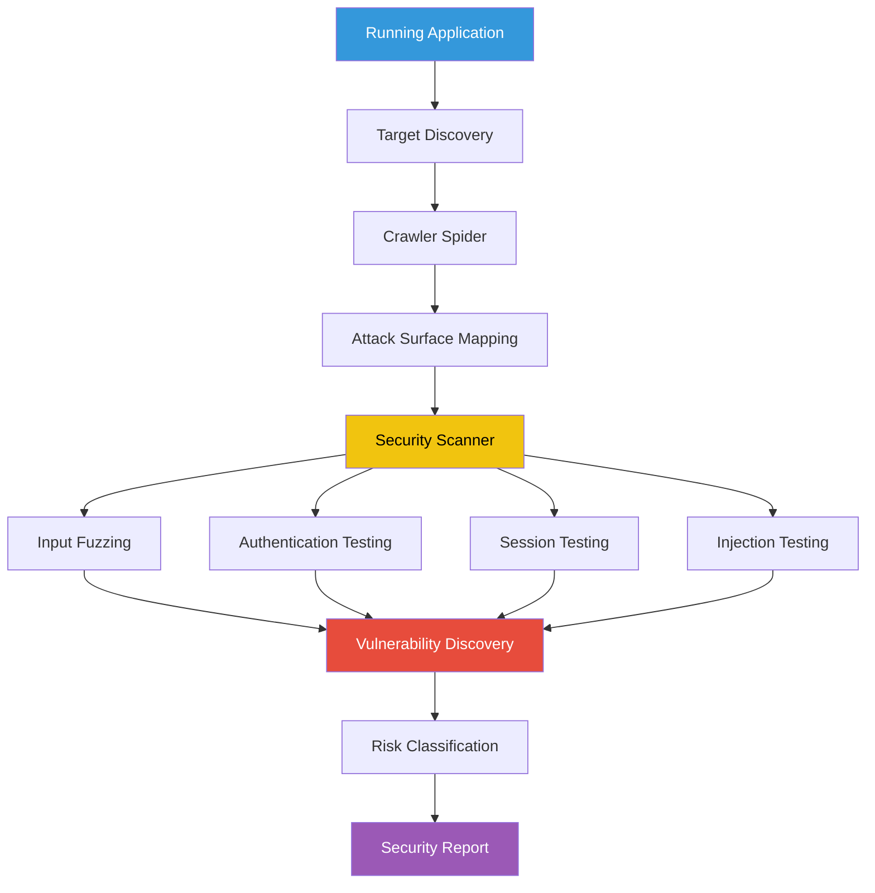

# DAST Testing Pipeline

```mermaid
flowchart TD

A[Running Application]

--> B[Target Discovery]

--> C[Crawler Spider]

--> D[Attack Surface Mapping]

--> E[Security Scanner]

E --> F[Input Fuzzing]
E --> G[Authentication Testing]
E --> H[Session Testing]
E --> I[Injection Testing]

F --> J[Vulnerability Discovery]
G --> J
H --> J
I --> J

J --> K[Risk Classification]

K --> L[Security Report]

style A fill:#3498db,color:#fff
style E fill:#f1c40f,color:#000
style J fill:#e74c3c,color:#fff
style L fill:#9b59b6,color:#fff
```
